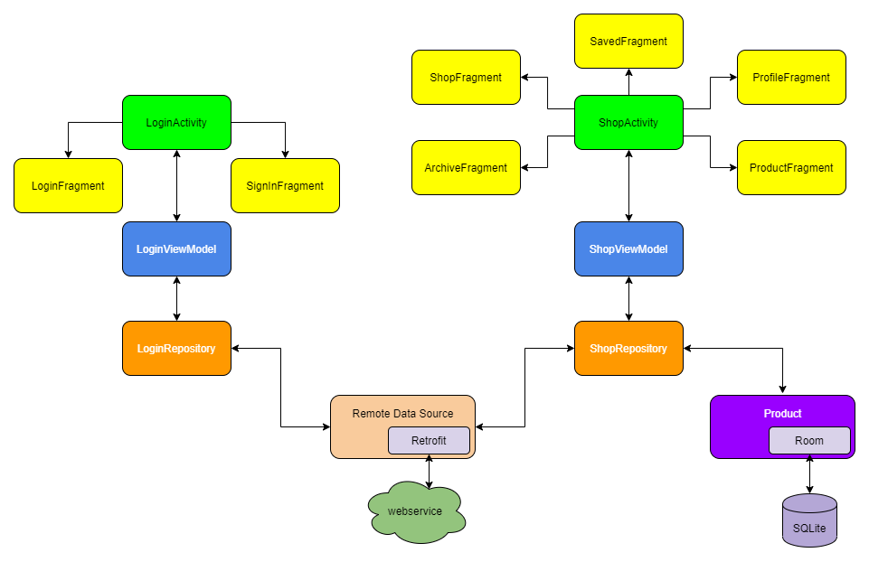

# MVVMShop
Project for the "Programming III" course, University of Perugia (2019-2020)

## Overview

## Dependencies
* [Material Design](https://material.io/develop/android/docs/getting-started/)
* [Swipe Refresh Layout](https://developer.android.com/training/swipe/add-swipe-interface)
* [Architectural Components](https://developer.android.com/topic/libraries/architecture)
* [Navigation Components](https://developer.android.com/guide/navigation/navigation-getting-started)
* [Coroutines](https://developer.android.com/kotlin/coroutines) - [Coroutine Lifecycle Scopes](https://developer.android.com/topic/libraries/architecture/coroutines)
* [Room](https://developer.android.com/training/data-storage/room) - [Coroutines Support for Room](https://developer.android.com/topic/libraries/architecture/room)
* [Retrofit2](https://square.github.io/retrofit/) - [Logging Interceptor](https://github.com/square/okhttp/tree/master/okhttp-logging-interceptor)
* [Glide](https://github.com/bumptech/glide)
* [dokka](https://github.com/Kotlin/dokka)

## Task Lists
- [x] authentication process
- [x] registration process
- [x] logout process
- [x] automatic login with shared preferences
- [x] show product catalog
- [x] show more product information
- [x] buy a single product
- [x] save a single product
- [x] show purchased products
- [x] show products saved in local db
- [x] show profile information with the wallet balance
- [x] add coupons section
- [x] check internet connectivity
- [ ] save products for a single user
- [ ] use dependency injection ([Dagger-Hilt](https://developer.android.com/training/dependency-injection/hilt-android))
- [ ] testing
